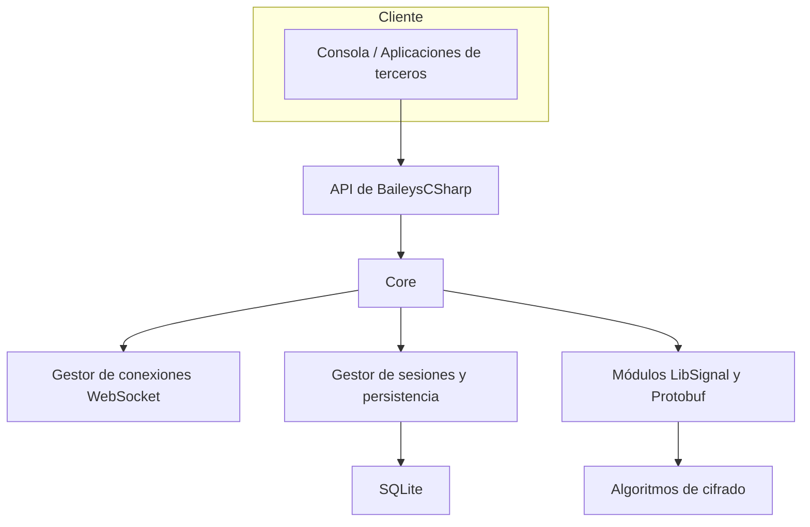

# 02. Arquitectura unificada

Este apartado describe la arquitectura actual observada en el código fuente y las interpretaciones de las tres auditorías.  Se divide en módulos y componentes para facilitar su comprensión. 

## Visión general

- **API pública:** las aplicaciones consumen el ensamblado `BaileysCSharp` para conectarse y enviar/recibir mensajes.  
- **Core:** agrupa lógica de eventos (`EventEmitter`), gestión de estados, modelos de mensajes y helpers.  
- **Gestor de conexiones:** implementa WebSocket con protocolos de WhatsApp, manejo de pings/pongs y reconexión básica.  
- **Persistencia:** utiliza SQLite para guardar sesiones, mensajes no enviados y estados de autenticación.  
- **Cifrado:** usa Protobuf para serializar mensajes (WAProto.cs) y LibSignal para el cifrado end‑to‑end.

## Puntos de acoplamiento

1. **Core vs Transporte:** la lógica de eventos y el transporte están fuertemente acoplados; dificultan sustituir el WebSocket por otro medio (e.g., pruebas locales).
2. **Persistencia directa:** el acceso a SQLite se realiza desde múltiples lugares sin una interfaz común, lo que complica el cambio a otra base de datos.
3. **Código generado:** `WAProto.cs` es un archivo gigantesco generado a partir de archivos `.proto` de WhatsApp.  Su inclusión en el mismo proyecto aumenta los tiempos de compilación y dificulta la navegación.

## Oportunidades de mejora

- Adoptar una **arquitectura hexagonal**, separando puertos (interfaces) y adaptadores (implementaciones).  
- Centralizar la **persistencia** detrás de un repositorio o interfaz que permita cambiar SQLite por otra tecnología (LiteDB, PostgreSQL embebido, etc.).  
- Extraer el cliente WebSocket a un servicio con políticas de reconexión configurables (reintentos, backoff).  
- Utilizar **inyección de dependencias** para desacoplar módulos.  
- Generar el código Protobuf en un proyecto independiente para reducir el tamaño del ensamblado principal.

Proveniencia: Codex, Jules, Copilot y análisis propio.
