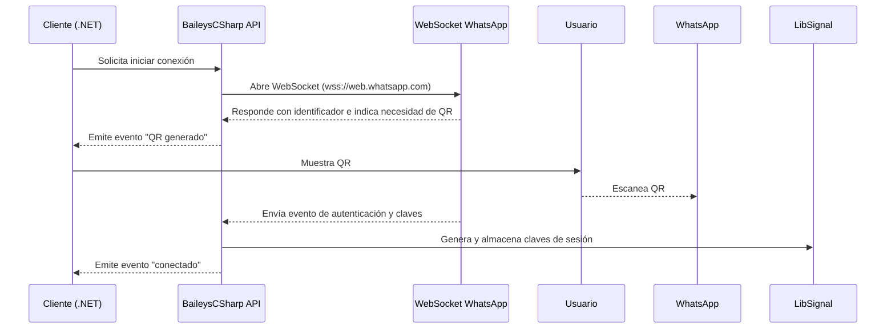
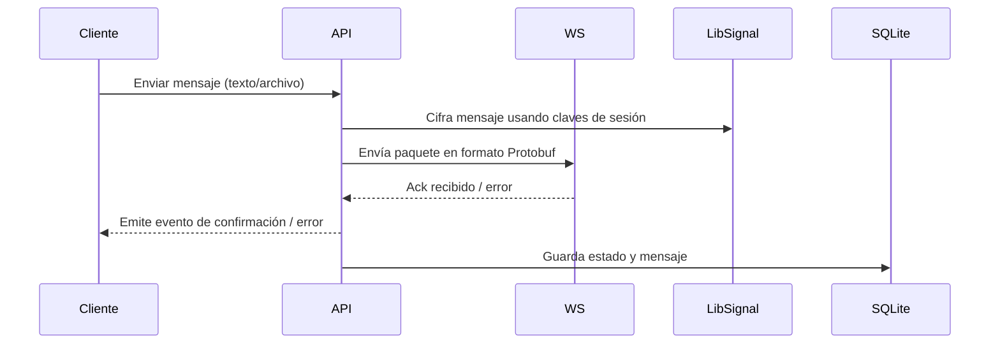
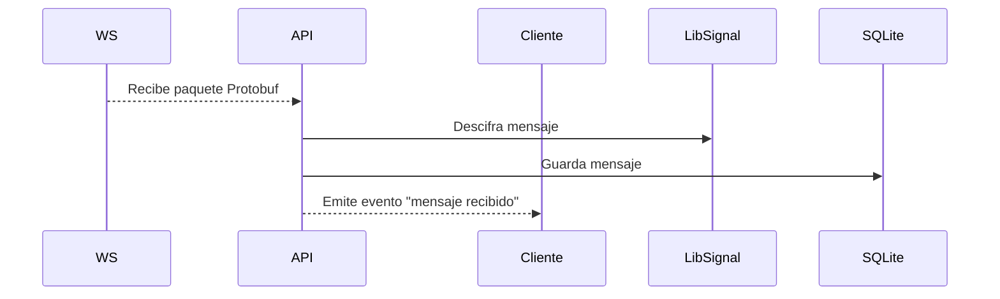
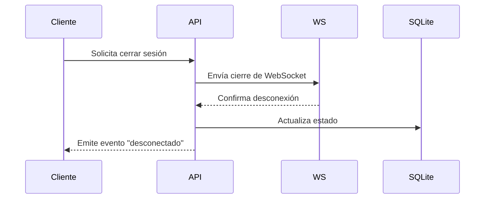

# 04. Flujos unificados

A continuación se describen los flujos principales del sistema, integrando aportes de las distintas auditorías y el análisis del código.

## Conectar y autenticar

## Enviar mensaje

## Recibir mensaje

## Cerrar conexión

Estos flujos permiten entender cómo se propagan las llamadas y eventos.  Se recomienda extraer estas secuencias en métodos bien definidos y añadir políticas de reintento y cancelación.

Proveniencia: Codex, Jules, Copilot y análisis propio.
