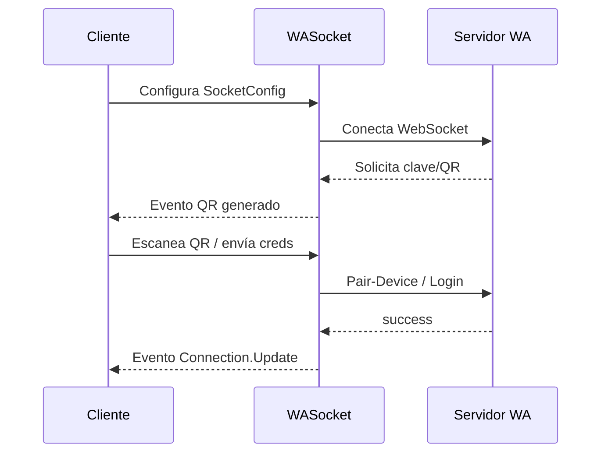
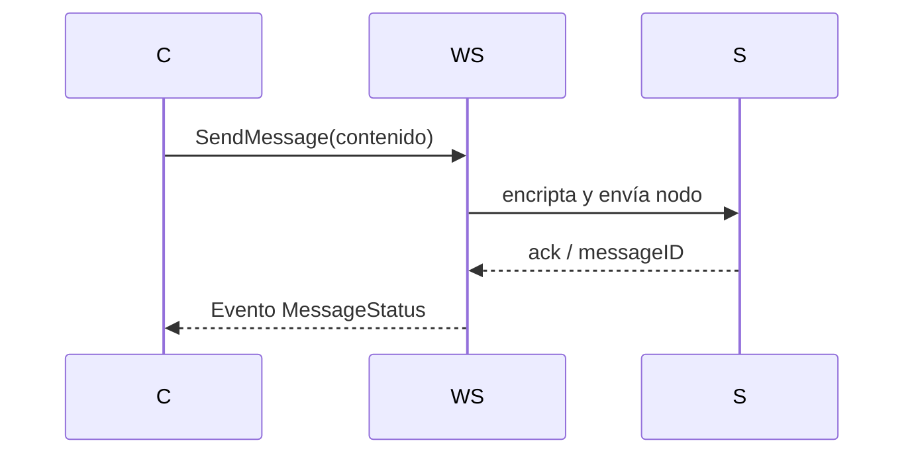
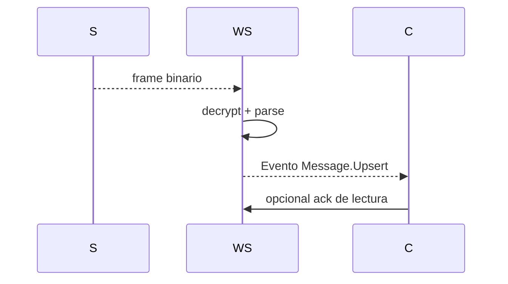
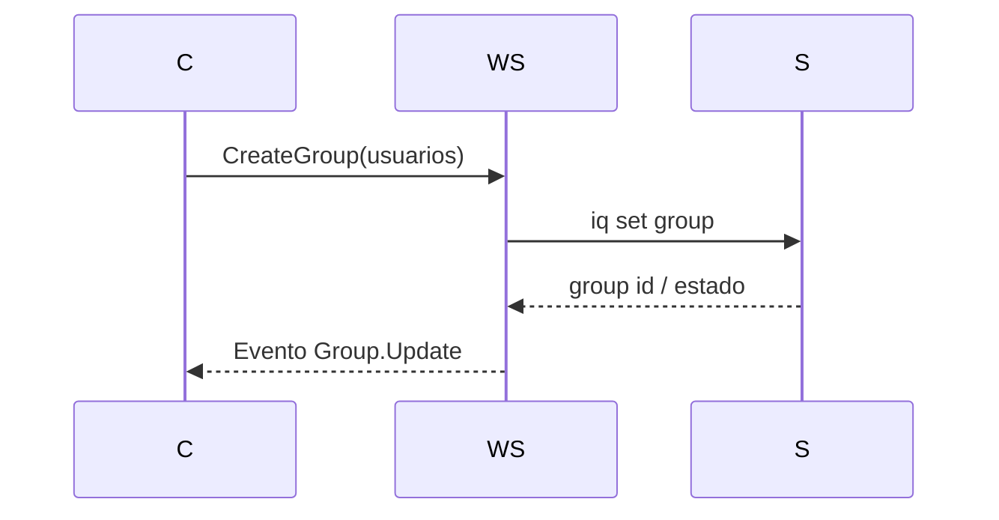
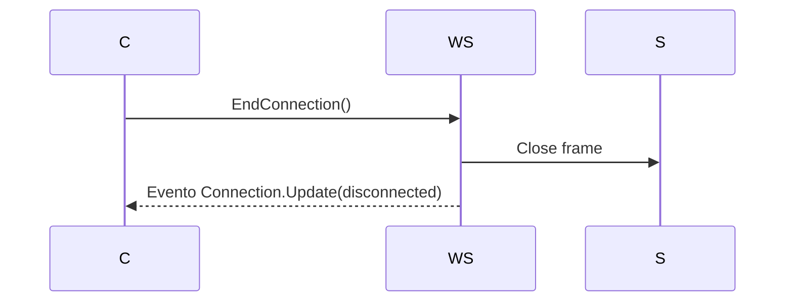

# 04. Flujos técnicos

## a) Conectar y autenticar

**Errores**: expiración de QR, conexión rechazada. **Retries**: regenerar QR, reconectar.

## b) Enviar mensaje (texto/media)

Errores: archivo demasiado grande, sesión inválida. Retries: reintento con backoff exponencial.

## c) Recibir mensaje/eventos

Errores: frame corrupto, clave rota. Retries: solicitar reenvío.

## d) Crear/gestionar grupos

Errores: usuario no válido. Retries: validar miembros.

## e) Cerrar conexión

Errores: desconexión abrupta; se intenta `Abort`.
