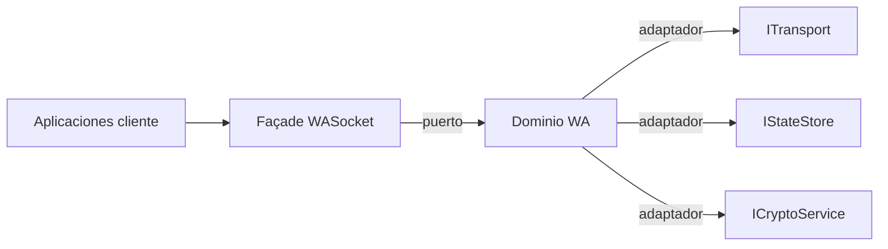

# 06b. Refactor de arquitectura

## Objetivos
- Separar dominio (eventos de WhatsApp) de infraestructura (transporte, almacenamiento, cifrado).
- Facilitar pruebas unitarias y sustitución de componentes.

## Propuesta hexagonal

## Componentes sugeridos
- **ITransport**: WebSocket, HTTP fallback.
- **IStateStore**: LiteDB, SQLite, memoria.
- **ICryptoService**: implementación sobre `System.Security.Cryptography` o wrappers.
- **DI/IoC**: `Microsoft.Extensions.DependencyInjection` para composición.

## Bounded contexts
- `Chat`, `Grupo`, `Media`, `Newsletter` como módulos independientes.
- Eventos normalizados a través de un `EventBus` interno.

## Contratos
- Definir interfaces claras para envío/recepción de mensajes (`IMessageService`).
- Documentar DTOs y evitar exponer tipos protobuf directamente.
