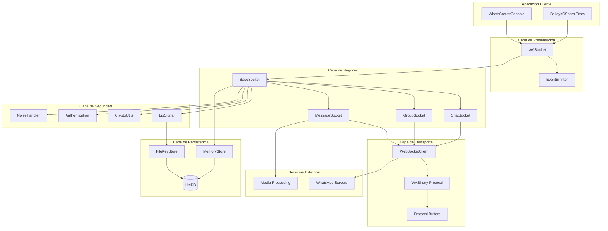
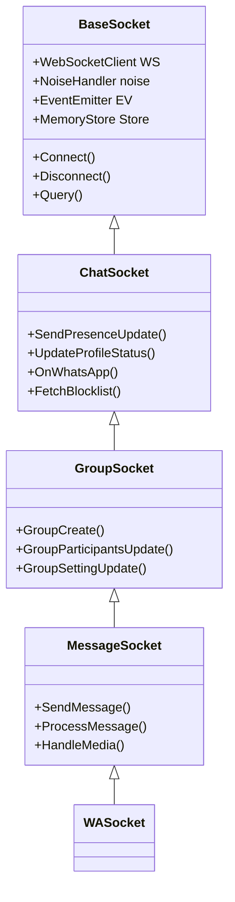
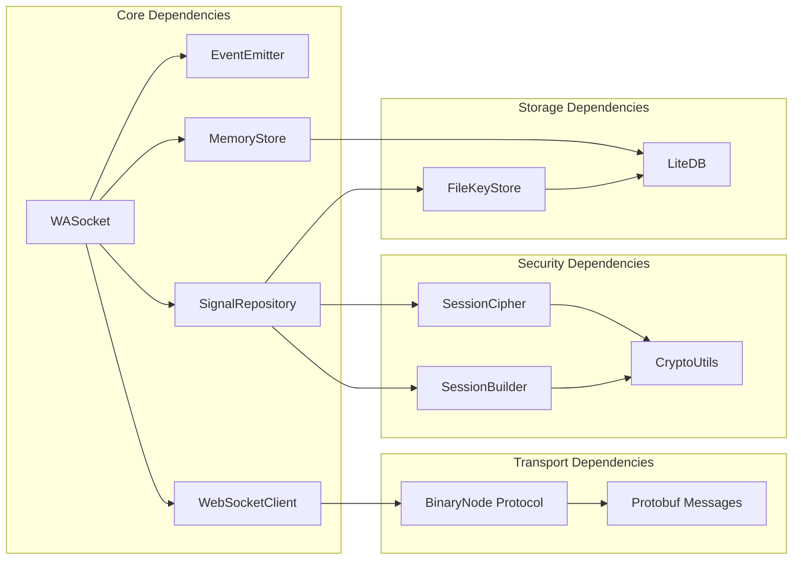
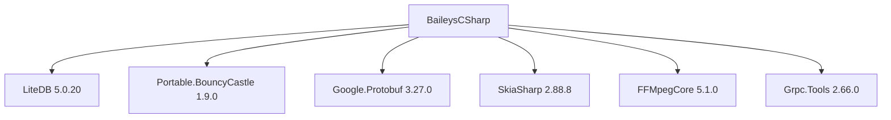

# Arquitectura Actual - BaileysCSharp

## 🏗️ Diagrama General de Arquitectura



## 🎯 Componentes Principales

### 1. **WASocket - Punto de Entrada Principal**
```csharp
public class WASocket : MessageSocket
{
    // Implementación principal que orquesta todas las funcionalidades
    // Hereda de MessageSocket -> GroupSocket -> ChatSocket -> BaseSocket
}
```

**Responsabilidades:**
- Orquestación de componentes
- Gestión del ciclo de vida de conexión
- Exposición de API pública

### 2. **BaseSocket - Funcionalidad Core**
```csharp
public abstract class BaseSocket : IDisposable
{
    protected AbstractSocketClient WS;
    protected NoiseHandler noise;
    protected SignalRepository Repository;
    public MemoryStore Store;
    public EventEmitter EV;
}
```

**Responsabilidades:**
- Gestión de conexión WebSocket
- Manejo de autenticación
- Coordinación de eventos
- Gestión de estado de sesión

### 3. **Jerarquía de Sockets**



## 🔄 Flujo de Dependencias

### Dependencias Internas


### Dependencias Externas


## 🏛️ Patrones Arquitectónicos Identificados

### 1. **Patrón Observer**
- `EventEmitter` para comunicación entre componentes
- Eventos tipados para diferentes dominios (Connection, Message, Auth)

### 2. **Patrón Template Method**
- Jerarquía de Socket classes con especializaciones
- Métodos virtuales en BaseSocket sobrescritos en clases derivadas

### 3. **Patrón Repository** (Parcial)
- `SignalRepository` para gestión de claves criptográficas
- `MemoryStore` para entidades de dominio

### 4. **Patrón Factory** (Implícito)
- Creación de mensajes protobuf
- Instanciación de ciphers criptográficos

## 🔗 Puntos de Acoplamiento Fuerte

### Problemas Identificados:

1. **BaseSocket es "God Class"**
   - 774 líneas de código
   - Múltiples responsabilidades
   - Difícil de testear unitariamente

2. **Dependencias Concretas**
   ```csharp
   // Acoplamiento directo a implementaciones concretas
   WS = new WebSocketClient(this);
   Store = new MemoryStore(config.CacheRoot, EV, Logger);
   ```

3. **Gestión de Estado Distribuida**
   - Estado repartido entre BaseSocket, MemoryStore y SignalRepository
   - Dificulta consistencia y transacciones

4. **Configuración Hardcodeada**
   ```csharp
   // Valores mágicos dispersos en el código
   private string[] Browser = ["Ubuntu", "Chrome", "20.0.04"];
   var keepAliveIntervalMs = 30000;
   ```

## 📊 Métricas de Complejidad

| Componente | Líneas | Responsabilidades | Dependencias | Complejidad |
|------------|--------|-------------------|--------------|-------------|
| BaseSocket | 774 | 8+ | 12+ | Alta |
| ChatSocket | 1238+ | 6+ | 8+ | Alta |
| MessageSocket | ~800 | 4+ | 6+ | Media |
| WebSocketClient | ~150 | 3 | 3 | Baja |
| MemoryStore | ~500 | 5+ | 4+ | Media |

## 🎯 Hotspots Arquitectónicos

### 1. **Gestión de Conexión**
- `BaseSocket.Connect()` y `WebSocketClient`
- Lógica compleja de reconexión y keep-alive
- Manejo de estado de conexión distribuido

### 2. **Procesamiento de Mensajes**
- `MessageSocket.ProcessMessage()`
- Pipeline complejo de deserialización, descifrado y procesamiento
- Múltiples formatos de mensaje (texto, media, grupos)

### 3. **Persistencia Multi-Store**
- `MemoryStore` para mensajes y chats
- `FileKeyStore` para claves criptográficas
- Inconsistencias en patrones de acceso a datos

### 4. **Criptografía y Seguridad**
- `SignalRepository` y `LibSignal`
- Implementación compleja del protocolo Signal
- Gestión de claves y sesiones

## 🔧 Oportunidades de Mejora

### 1. **Separación de Concerns**
```csharp
// Estado actual
public class BaseSocket {
    // Connection + Auth + Crypto + Events + Storage
}

// Propuesta
public class WASocket {
    private readonly IConnectionManager _connection;
    private readonly IAuthService _auth;
    private readonly ICryptoService _crypto;
    private readonly IEventBus _events;
    private readonly IMessageRepository _messages;
}
```

### 2. **Inyección de Dependencias**
```csharp
// Estado actual
WS = new WebSocketClient(this);

// Propuesta
public WASocket(IWebSocketClient webSocket, /* otros servicios */) {
    _webSocket = webSocket;
}
```

### 3. **Configuración Centralizada**
```csharp
public class WhatsAppConfig {
    public string UserAgent { get; set; }
    public int KeepAliveInterval { get; set; }
    public int MaxReconnectAttempts { get; set; }
    // etc...
}
```

## 🏁 Conclusiones Arquitectónicas

**Fortalezas:**
- Funcionalidad completa implementada
- Patrones reconocibles en ciertas áreas
- Separación clara entre transporte y lógica de negocio

**Debilidades:**
- Alto acoplamiento entre componentes
- Responsabilidades mezcladas
- Difícil testabilidad y mantenibilidad
- Falta de abstracción en servicios críticos

**Recomendación:** Refactoring arquitectónico incremental manteniendo funcionalidad existente.
