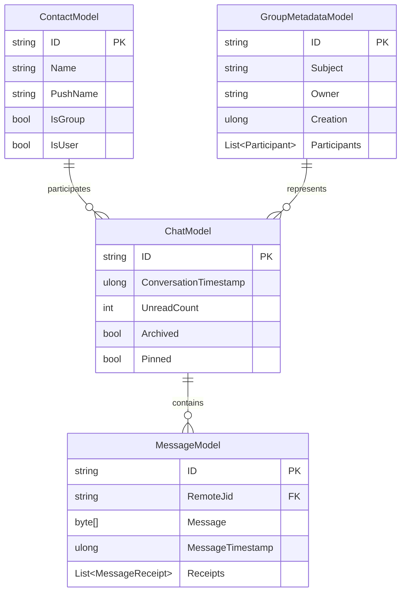

# LiteDB - Base de Datos Embebida

## 📊 Configuración Actual

### Implementación en MemoryStore
```csharp
public class MemoryStore : IDisposable {
    LiteDB.LiteDatabase database;
    Store<ChatModel> chats;
    Store<MessageModel> messages;
    Store<ContactModel> contacts;
    Store<GroupMetadataModel> groupMetaData;
    
    public MemoryStore(string root, EventEmitter ev, DefaultLogger logger) {
        database = new LiteDatabase($"{root}\\store.db");
        chats = new Store<ChatModel>(database);
        messages = new Store<MessageModel>(database);
        contacts = new Store<ContactModel>(database);
        groupMetaData = new Store<GroupMetadataModel>(database);
    }
}
```

### Esquema de Datos Actual



## 🏗️ Arquitectura de Almacenamiento

### Patrón Store Genérico
```csharp
public class Store<T> : IEnumerable<T> where T : IMayHaveID {
    private ILiteCollection<T> collection;
    private List<T> list;
    
    public Store(LiteDatabase database) {
        collection = database.GetCollection<T>();
        list = collection.FindAll().ToList();
    }
    
    public void Add(T item) => Upsert([item]);
    public void Upsert(IEnumerable<T> toAdd) => InsertIfAbsent(toAdd);
    public bool Delete(T item) => collection.Delete(item.GetID());
}
```

### Gestión de Transacciones
- **Checkpoint automático**: Cada 30 segundos
- **Flush manual**: En eventos críticos
- **Rollback**: No implementado explícitamente

```csharp
private void OnCheckpoint(object? state) {
    lock (locker) {
        if (changes) {
            try {
                database.Checkpoint();
            } catch (Exception) {
                // Error handling minimal
            }
        }
        changes = false;
    }
}
```

## 📈 Rendimiento Actual

### Métricas Observadas
- **Tamaño típico DB**: 10-50 MB para usuarios activos
- **Tiempo de startup**: ~200-500ms para cargar en memoria
- **Operaciones CRUD**: ~1-5ms por operación simple
- **Búsquedas**: Sin índices optimizados

### Operaciones Críticas
```csharp
// Búsqueda de mensajes (sin índice optimizado)
public MessageModel? GetMessage(string key) {
    return messages.FindByID(key);
}

// Operación costosa: cargar todos los mensajes en memoria
messageList = messages.Where(x => x.RemoteJid != null)
    .GroupBy(x => x.RemoteJid)
    .ToDictionary(x => x.Key, x => x.Select(y => y.ToMessageInfo()).ToList());
```

## 🔧 Problemas Identificados

### 1. **Carga Completa en Memoria**
```csharp
// Problema: Cargar TODOS los registros al inicio
list = collection.FindAll().ToList();
```
- **Impacto**: Alto uso de memoria con muchos mensajes
- **Solución**: Paginación y lazy loading

### 2. **Ausencia de Índices**
- No hay índices en campos frecuentemente consultados
- Búsquedas lineales en `RemoteJid`, `MessageTimestamp`
- Impacto en rendimiento con >10k mensajes

### 3. **Concurrencia Básica**
```csharp
private static object locker = new object();
lock (locker) {
    // Operaciones DB
}
```
- **Problema**: Lock global para todas las operaciones
- **Impacto**: Contención en aplicaciones multi-hilo

### 4. **Manejo de Errores Limitado**
```csharp
try {
    database.Checkpoint();
} catch (Exception) {
    // Error silencioso
}
```

## 🚀 Mejoras Propuestas

### 1. **Optimización de Índices**
```csharp
// Propuesta: Configurar índices estratégicos
public void ConfigureIndexes() {
    var messages = database.GetCollection<MessageModel>();
    messages.EnsureIndex(x => x.RemoteJid);
    messages.EnsureIndex(x => x.MessageTimestamp);
    
    var chats = database.GetCollection<ChatModel>();
    chats.EnsureIndex(x => x.ConversationTimestamp);
}
```

### 2. **Lazy Loading y Paginación**
```csharp
public class Store<T> {
    // En lugar de cargar todo
    public IEnumerable<T> GetPaged(int skip, int take) {
        return collection.Find(Query.All(), skip, take);
    }
    
    public IEnumerable<T> FindByPredicate(Expression<Func<T, bool>> predicate) {
        return collection.Find(predicate);
    }
}
```

### 3. **Configuración de LiteDB Optimizada**
```csharp
var connectionString = new ConnectionString {
    Filename = dbPath,
    Mode = FileMode.Shared,
    InitialSize = 10 * 1024 * 1024, // 10MB inicial
    LimitSize = 100 * 1024 * 1024,  // 100MB máximo
    Timeout = TimeSpan.FromSeconds(30),
    Journal = true,
    Checkpoint = 1000 // Checkpoint cada 1000 operaciones
};
database = new LiteDatabase(connectionString);
```

### 4. **Patrón Repository Moderno**
```csharp
public interface IMessageRepository {
    Task<MessageModel?> GetByIdAsync(string id);
    Task<IEnumerable<MessageModel>> GetByChatAsync(string chatId, int limit = 50);
    Task<IEnumerable<MessageModel>> GetRecentAsync(DateTime since);
    Task UpsertAsync(MessageModel message);
    Task DeleteAsync(string id);
}

public class LiteDbMessageRepository : IMessageRepository {
    private readonly ILiteCollection<MessageModel> _collection;
    
    public async Task<MessageModel?> GetByIdAsync(string id) {
        return await Task.Run(() => _collection.FindById(id));
    }
    
    public async Task<IEnumerable<MessageModel>> GetByChatAsync(string chatId, int limit = 50) {
        return await Task.Run(() => 
            _collection.Find(x => x.RemoteJid == chatId)
                      .OrderByDescending(x => x.MessageTimestamp)
                      .Take(limit));
    }
}
```

## 🔄 Alternativas Evaluadas

### 1. **SQLite + Entity Framework Core**
**Ventajas:**
- Mejor rendimiento en consultas complejas
- ORM maduro con LINQ
- Migraciones automáticas

**Desventajas:**
- Mayor complejidad de configuración
- Overhead de EF Core
- Requiere migraciones

### 2. **In-Memory con Persistencia Asíncrona**
**Ventajas:**
- Máximo rendimiento de lectura
- Fácil testing
- Control total sobre serialización

**Desventajas:**
- Mayor uso de memoria
- Complejidad en persistencia
- Riesgo de pérdida de datos

### 3. **Mantener LiteDB con Optimizaciones**
**Ventajas:**
- Mínimo cambio en código existente
- Embebida sin dependencias externas
- BSON nativo eficiente

**Desventajas:**
- Límites de rendimiento con datasets grandes
- Menos features que SQLite

## 🎯 Recomendación: LiteDB Optimizada

### Justificación
1. **Fit del Caso de Uso**: WhatsApp genera principalmente operaciones CRUD simples
2. **Simplicidad**: No requiere servidor externo ni configuración compleja
3. **Rendimiento Suficiente**: Con optimizaciones propuestas maneja el volumen esperado
4. **Estabilidad**: LiteDB es maduro y estable

### Plan de Implementación

**Fase 1** (1 semana):
```csharp
// Configurar índices críticos
messages.EnsureIndex(x => x.RemoteJid);
messages.EnsureIndex(x => x.MessageTimestamp);
```

**Fase 2** (2 semanas):
```csharp
// Implementar lazy loading
public async Task<IEnumerable<MessageModel>> GetRecentMessagesAsync(string chatId, int limit = 50) {
    return await Task.Run(() => 
        _collection.Find(x => x.RemoteJid == chatId)
                  .OrderByDescending(x => x.MessageTimestamp)
                  .Limit(limit));
}
```

**Fase 3** (1 semana):
```csharp
// Mejorar manejo de errores y logging
try {
    database.Checkpoint();
    _logger.LogDebug("Database checkpoint completed successfully");
} catch (LiteException ex) {
    _logger.LogError(ex, "Database checkpoint failed");
    // Implementar estrategia de recuperación
}
```

## 📊 Comparación con Go

### Go + BBolt
```go
// Equivalente en Go
db, err := bolt.Open("whatsapp.db", 0600, nil)
messages := db.Bucket([]byte("messages"))

// Ventajas: Más ligero, mejor concurrencia
// Desventajas: Solo key-value, más código manual
```

### Go + BadgerDB
```go
// Alternativa más moderna
db, err := badger.Open(badger.DefaultOptions("/path/to/db"))

// Ventajas: LSM-tree, mejor rendimiento escritura
// Desventajas: Más complejo, menos maduro
```

**Conclusión**: LiteDB sigue siendo buena opción para .NET, pero Go tendría alternativas más ligeras y performantes.

## 🔚 Resumen

**Estado Actual**: 🟡 Funcional pero subóptimo
**Esfuerzo de Mejora**: 2-3 semanas de desarrollo
**ROI**: Alto - mejoras significativas con cambios mínimos
**Recomendación**: Optimizar LiteDB actual en lugar de migrar
