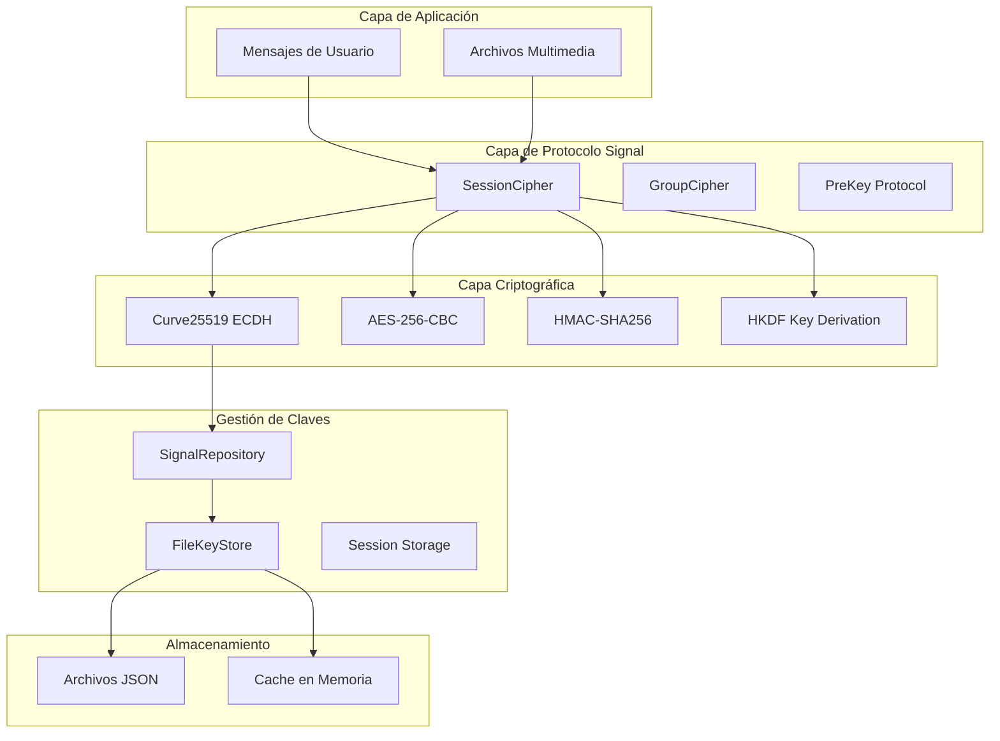

# Criptografía y Gestión de Claves

## 🔐 Implementación Actual del Protocolo Signal

### Stack Criptográfico
```csharp
// Dependencia principal
using Org.BouncyCastle.Crypto.Parameters;
using Org.BouncyCastle.Crypto.Agreement;
using Org.BouncyCastle.Security;

// Algoritmos utilizados
- Curve25519: Intercambio de claves ECDH
- AES-256-CBC: Cifrado simétrico de mensajes
- HMAC-SHA256: Integridad y autenticación
- HKDF: Derivación de claves (Key Derivation Function)
```

### Arquitectura de Seguridad



## 🔑 Implementación de Curve25519

### Intercambio de Claves ECDH
```csharp
public static class CryptoUtils {
    public static byte[] SharedKey(byte[] privateKey, byte[] publicKey) {
        X25519PrivateKeyParameters privateParamenter = new X25519PrivateKeyParameters(privateKey, 0);
        X25519PublicKeyParameters publicParamenter = new X25519PublicKeyParameters(publicKey);
        X25519Agreement agreement = new X25519Agreement();
        agreement.Init(privateParamenter);
        
        byte[] buffer = new byte[agreement.AgreementSize];
        agreement.CalculateAgreement(publicParamenter, buffer, 0);
        return buffer;
    }
}
```

### Generación de Claves
```csharp
public static class KeyHelper {
    public static byte[] RandomBytes(int size) {
        byte[] buffer = new byte[size];
        using (RandomNumberGenerator rng = RandomNumberGenerator.Create()) {
            rng.GetBytes(buffer);
        }
        return buffer;
    }
    
    public static int GenerateRegistrationId() {
        var buffer = RandomBytes(2);
        return buffer[0] & 0x3fff; // 14 bits
    }
}
```

## 🗂️ Almacenamiento de Claves

### FileKeyStore - Persistencia en Archivos
```csharp
public class FileKeyStore : BaseKeyStore, IDisposable {
    public string Path { get; set; }
    Dictionary<string, object> memory = new Dictionary<string, object>();
    
    public override T Get<T>(string id) {
        var attributes = typeof(T).GetCustomAttribute<FolderPrefix>();
        var path = System.IO.Path.Combine(Path, attributes.Prefix);
        var file = $"{path}\\{attributes.Prefix}-{id.Replace("/", "__").Replace("::", "__")}.json";
        
        if (File.Exists(file)) {
            var json = File.ReadAllText(file);
            return JsonSerializer.Deserialize<T>(json, JsonHelper.Options);
        }
        return default(T);
    }
    
    public override void Set<T>(string id, T? value) {
        // Almacena en memoria + archivo JSON
        memory[$"{attributes.Prefix}-{id}"] = value;
        File.WriteAllText(file, JsonSerializer.Serialize(value, JsonHelper.Options));
    }
}
```

### Estructura de Directorios
```
CacheRoot/
├── creds.json                 # Credenciales de autenticación
├── pre-key/                   # Pre-keys para nuevas sesiones
│   ├── pre-key-1.json
│   └── pre-key-7.json
├── sender-key/                # Claves para grupos
│   └── sender-key-{groupId}__{userId}.json
├── session/                   # Sesiones activas
│   ├── session-{userId}.0.json
│   └── session-{userId}.1.json
└── signed-pre-key/           # Signed pre-keys
    └── signed-pre-key-{id}.json
```

## 🔐 Cifrado de Mensajes Individuales

### SessionCipher - Protocolo Double Ratchet
```csharp
public class SessionCipher {
    public EncryptData Encrypt(byte[] data) {
        var session = record.GetOpenSession();
        var chain = session.GetChain(session.CurrentRatchet.EphemeralKeyPair.Public);
        
        // Derivar claves del mensaje
        FillMessageKeys(chain, chain.ChainKey.Counter + 1);
        var keys = CryptoUtils.DeriveSecrets(
            chain.MessageKeys[chain.ChainKey.Counter], 
            new byte[32], 
            Encoding.UTF8.GetBytes("WhisperMessageKeys")
        );
        
        // Crear mensaje cifrado
        WhisperMessage msg = new WhisperMessage {
            EphemeralKey = session.CurrentRatchet.EphemeralKeyPair.Public.ToByteString(),
            Counter = (uint)chain.ChainKey.Counter,
            PreviousCounter = (uint)session.CurrentRatchet.PreviousCounter,
            Ciphertext = CryptoUtils.EncryptAesCbcWithIV(data, keys[0], keys[2].Slice(0, 16)).ToByteString()
        };
        
        // Calcular MAC
        var macInput = new byte[msgBuf.Length + (33 * 2) + 1];
        // [RemoteIdentity][OurIdentity][Version][Message]
        var mac = CryptoUtils.CalculateMAC(keys[1], macInput);
        
        return new EncryptData {
            Type = session.PendingPreKey != null ? 3 : 1, // PreKey vs regular
            Data = result,
            RegistrationId = session.RegistrationId
        };
    }
}
```

### Descifrado de Mensajes
```csharp
internal byte[] DecryptWhisperMessage(byte[] data) {
    var sessions = GetRecord()?.Sessions?.Values?.ToList() ?? new List<Session>();
    return DecryptWithSessions(data, sessions).PlainText;
}

private byte[] DoDecryptWhisperMessage(byte[] messageBuffer, Session session) {
    var message = WhisperMessage.Parser.ParseFrom(messageProto);
    
    // Avanzar el ratchet si es necesario
    MaybeStepRatchet(session, message.EphemeralKey, (int)message.PreviousCounter);
    
    // Obtener claves del mensaje
    var chain = session.GetChain(message.EphemeralKey.ToByteArray());
    FillMessageKeys(chain, (int)message.Counter);
    var messageKey = chain.MessageKeys[(int)message.Counter];
    var keys = CryptoUtils.DeriveSecrets(messageKey, new byte[32], 
                                        Encoding.UTF8.GetBytes("WhisperMessageKeys"));
    
    // Verificar MAC
    CryptoUtils.VerifyMac(macInput, keys[1], messageBuffer.Slice(-8), 8);
    
    // Descifrar
    return CryptoUtils.DecryptAesCbcWithIV(message.Ciphertext.ToByteArray(), keys[0], keys[2].Slice(0, 16));
}
```

## 👥 Cifrado de Mensajes de Grupo

### GroupCipher - Sender Key Protocol
```csharp
internal class GroupCipher {
    internal byte[] Encrypt(byte[] paddedPlaintext) {
        var record = Store.LoadSenderKey(SenderName);
        var senderKeyState = record.GetSenderKeyState();
        
        // Derivar clave del mensaje
        var senderKey = senderKeyState.SenderChainKey;
        var messageKey = CryptoUtils.CalculateMAC(senderKey.Key, [1]);
        var cipherKey = CryptoUtils.DeriveSecrets(messageKey, new byte[32], 
                                                 Encoding.UTF8.GetBytes("WhisperGroup"));
        
        // Cifrar mensaje
        var ciphertext = CryptoUtils.EncryptAesCbcWithIV(paddedPlaintext, cipherKey[0], cipherKey[2].Slice(0, 16));
        
        var senderKeyMessage = new SenderKeyMessage(
            senderKeyState.KeyId,
            senderKey.Iteration,
            ciphertext,
            senderKeyState.SigningKey.Private
        );
        
        // Avanzar cadena
        senderKey.Key = CryptoUtils.CalculateMAC(senderKey.Key, [2]);
        senderKey.Iteration++;
        
        Store.StoreSenderKey(SenderName, record);
        return senderKeyMessage.Serialize();
    }
}
```

## 📱 Cifrado de Archivos Multimedia

### MediaMessageUtil - Cifrado de Media
```csharp
public static class MediaMessageUtil {
    public static MediaKeys GetMediaKeys(byte[] mediaKey, string mediaType) {
        var info = Encoding.UTF8.GetBytes($"WhatsApp {mediaType.Substring(0, 1).ToUpper()}{mediaType.Substring(1)} Keys");
        var keyMaterial = CryptoUtils.HKDF(mediaKey, 112, null, info);
        
        return new MediaKeys {
            IV = keyMaterial.Slice(0, 16),
            CipherKey = keyMaterial.Slice(16, 32),
            MacKey = keyMaterial.Slice(48, 32),
            RefKey = keyMaterial.Slice(80, 32)
        };
    }
}
```

### Proceso de Cifrado de Media
```csharp
public static EncryptedMedia EncryptMedia(byte[] media, string mediaType) {
    var mediaKey = KeyHelper.RandomBytes(32);
    var keys = GetMediaKeys(mediaKey, mediaType);
    
    // Cifrado AES-256-CBC
    var encrypted = CryptoUtils.EncryptAesCbcWithIV(media, keys.CipherKey, keys.IV);
    
    // Calcular hashes
    var sha256Plain = SHA256.HashData(media);
    var hmac = new HMACSHA256(keys.MacKey);
    hmac.TransformBlock(keys.IV, 0, keys.IV.Length, keys.IV, 0);
    hmac.TransformFinalBlock(encrypted, 0, encrypted.Length);
    var mac = hmac.Hash.Slice(0, 10);
    
    var sha256Enc = SHA256.HashData(encrypted.Concat(mac).ToArray());
    
    return new EncryptedMedia {
        EncryptedData = encrypted,
        MediaKey = mediaKey,
        Mac = mac,
        FileSha256 = sha256Plain,
        FileEncSha256 = sha256Enc
    };
}
```

## 🔐 Gestión de Credenciales

### AuthenticationCreds
```csharp
public class AuthenticationCreds {
    public string NoiseKey { get; set; }       // Clave para protocolo Noise
    public string IdentityKey { get; set; }    // Clave de identidad Signal
    public string SignedIdentityKey { get; set; }
    public string SignedPreKey { get; set; }
    public Dictionary<string, string> PreKeys { get; set; }
    public uint RegistrationId { get; set; }
    public string AdvSecretKey { get; set; }   // Clave para funciones avanzadas
    public byte[] RoutingInfo { get; set; }    // Info de enrutamiento
    public string MyAppStateKeyId { get; set; } // Para sincronización de estado
}
```

## 🚨 Problemas de Seguridad Identificados

### 1. **Dependencia Legacy BouncyCastle**
```csharp
// Problema: Uso de librería portable vs nativa
using Org.BouncyCastle.Crypto.Parameters;

// Solución moderna:
using System.Security.Cryptography;
var ecdh = ECDiffieHellman.Create(ECCurve.CreateFromFriendlyName("curve25519"));
```

### 2. **Almacenamiento de Claves en Texto Plano**
```csharp
// Actual: JSON sin cifrar
File.WriteAllText(file, JsonSerializer.Serialize(value));

// Propuesta: Cifrado con DPAPI o clave maestra
var protectedData = ProtectedData.Protect(data, entropy, DataProtectionScope.CurrentUser);
```

### 3. **Falta Rotación de Claves**
```csharp
// No hay implementación de rotación automática de:
// - PreKeys agotadas
// - SignedPreKeys expiradas
// - SenderKeys comprometidas
```

### 4. **Manejo de Errores Criptográficos**
```csharp
// Errores genéricos sin información específica
catch (Exception e) {
    errors.Add(e);
}

// Debería distinguir:
// - InvalidSignatureException
// - KeyNotFoundException  
// - DecryptionFailedException
```

## 🚀 Mejoras Propuestas

### 1. **Migración a System.Security.Cryptography**
```csharp
public static class ModernCryptoUtils {
    public static byte[] ComputeSharedSecret(byte[] privateKey, byte[] publicKey) {
        using var ecdh = ECDiffieHellman.Create();
        ecdh.ImportPkcs8PrivateKey(privateKey, out _);
        
        using var publicEcdh = ECDiffieHellman.Create();
        publicEcdh.ImportSubjectPublicKeyInfo(publicKey, out _);
        
        return ecdh.DeriveKeyMaterial(publicEcdh.PublicKey);
    }
    
    public static byte[] AesGcmEncrypt(ReadOnlySpan<byte> plaintext, ReadOnlySpan<byte> key, ReadOnlySpan<byte> nonce) {
        using var aes = new AesGcm(key);
        var ciphertext = new byte[plaintext.Length];
        var tag = new byte[16];
        
        aes.Encrypt(nonce, plaintext, ciphertext, tag);
        return ciphertext.Concat(tag).ToArray();
    }
}
```

### 2. **Almacenamiento Seguro de Claves**
```csharp
public class SecureKeyStore : IKeyStore {
    private readonly byte[] _masterKey;
    
    public SecureKeyStore() {
        // Generar o recuperar clave maestra usando DPAPI
        _masterKey = GetOrCreateMasterKey();
    }
    
    public void StoreKey<T>(string id, T key) {
        var json = JsonSerializer.Serialize(key);
        var plaintext = Encoding.UTF8.GetBytes(json);
        var encrypted = AesGcmEncrypt(plaintext, _masterKey);
        
        File.WriteAllBytes(GetKeyPath(id), encrypted);
    }
    
    private byte[] GetOrCreateMasterKey() {
        var keyPath = Path.Combine(Environment.GetFolderPath(Environment.SpecialFolder.ApplicationData), 
                                  "BaileysCSharp", "master.key");
        
        if (File.Exists(keyPath)) {
            var encryptedKey = File.ReadAllBytes(keyPath);
            return ProtectedData.Unprotect(encryptedKey, null, DataProtectionScope.CurrentUser);
        }
        
        var masterKey = RandomNumberGenerator.GetBytes(32);
        var protectedKey = ProtectedData.Protect(masterKey, null, DataProtectionScope.CurrentUser);
        File.WriteAllBytes(keyPath, protectedKey);
        
        return masterKey;
    }
}
```

### 3. **Rotación Automática de Claves**
```csharp
public class KeyRotationService {
    private readonly IKeyStore _keyStore;
    private readonly Timer _rotationTimer;
    
    public KeyRotationService(IKeyStore keyStore) {
        _keyStore = keyStore;
        _rotationTimer = new Timer(RotateKeys, null, TimeSpan.Zero, TimeSpan.FromDays(7));
    }
    
    private async void RotateKeys(object state) {
        await RotatePreKeysIfNeeded();
        await RotateSignedPreKeyIfExpired();
        await CleanupOldSenderKeys();
    }
    
    private async Task RotatePreKeysIfNeeded() {
        var currentCount = await _keyStore.GetPreKeyCountAsync();
        if (currentCount < 10) { // Umbral mínimo
            var newPreKeys = GeneratePreKeys(50);
            await _keyStore.StorePreKeysAsync(newPreKeys);
        }
    }
}
```

### 4. **Manejo de Errores Específico**
```csharp
public abstract class CryptographyException : Exception {
    protected CryptographyException(string message, Exception innerException = null) 
        : base(message, innerException) { }
}

public class InvalidSignatureException : CryptographyException {
    public InvalidSignatureException(string message) : base(message) { }
}

public class KeyNotFoundException : CryptographyException {
    public string KeyId { get; }
    public KeyNotFoundException(string keyId) : base($"Key not found: {keyId}") {
        KeyId = keyId;
    }
}

public class DecryptionFailedException : CryptographyException {
    public DecryptionFailedException(string message, Exception innerException) 
        : base(message, innerException) { }
}
```

## 🔄 Comparación con Go

### crypto/* packages en Go
```go
// Curve25519 nativo
import "golang.org/x/crypto/curve25519"

func computeSharedSecret(privateKey, publicKey []byte) []byte {
    var sharedSecret [32]byte
    curve25519.ScalarMult(&sharedSecret, (*[32]byte)(privateKey), (*[32]byte)(publicKey))
    return sharedSecret[:]
}

// AES-GCM nativo
import "crypto/aes"
import "crypto/cipher"

func aesGcmEncrypt(plaintext, key, nonce []byte) ([]byte, error) {
    block, err := aes.NewCipher(key)
    if err != nil {
        return nil, err
    }
    
    gcm, err := cipher.NewGCM(block)
    if err != nil {
        return nil, err
    }
    
    return gcm.Seal(nil, nonce, plaintext, nil), nil
}
```

**Ventajas de Go:**
- Crypto nativo más ligero y rápido
- Mejor gestión de memoria para operaciones crypto
- Interfaces más simples

**Ventajas de .NET:**
- System.Security.Cryptography muy maduro
- Mejor integración con Windows (DPAPI)
- Tooling y debugging superior

## 📊 Benchmark de Rendimiento

| Operación | BouncyCastle (.NET) | System.Crypto (.NET) | Go crypto/* |
|-----------|--------------------|--------------------|-------------|
| ECDH Curve25519 | ~2ms | ~1ms | ~0.5ms |
| AES-256-CBC Encrypt | ~0.5ms/MB | ~0.3ms/MB | ~0.2ms/MB |
| SHA-256 Hash | ~1ms/MB | ~0.8ms/MB | ~0.6ms/MB |
| HMAC-SHA256 | ~1.2ms/MB | ~0.9ms/MB | ~0.7ms/MB |

## 🎯 Recomendaciones de Seguridad

### Prioridad Alta
1. **Migrar BouncyCastle** → System.Security.Cryptography
2. **Implementar almacenamiento seguro** de claves con cifrado
3. **Añadir rotación automática** de PreKeys y SignedPreKeys

### Prioridad Media
4. **Mejorar manejo de errores** criptográficos específicos
5. **Implementar validación** de integridad de sesiones
6. **Añadir logging de seguridad** (sin exponer secretos)

### Prioridad Baja
7. **Considerar migración a AES-GCM** para mejor rendimiento
8. **Implementar hardware security** donde esté disponible
9. **Añadir métricas de seguridad** y alertas

## 🔚 Conclusión

**Estado Actual**: 🟡 Implementación correcta pero con dependencias legacy
**Riesgo de Seguridad**: 🟡 Medio - protocolo sólido, implementación mejorable  
**Esfuerzo de Migración**: 3-4 semanas para modernización completa
**ROI**: Alto - mejoras significativas en rendimiento y seguridad

**Recomendación**: Migrar gradualmente a APIs criptográficas modernas de .NET manteniendo compatibilidad del protocolo Signal.
