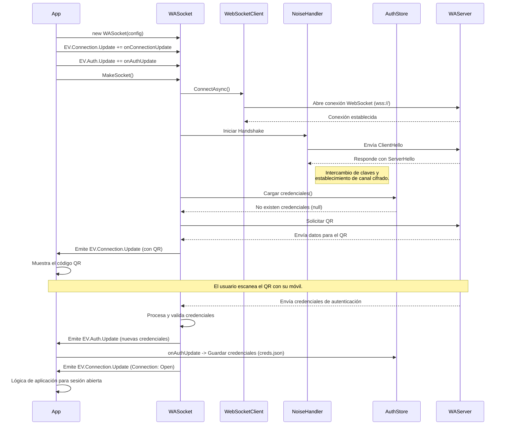
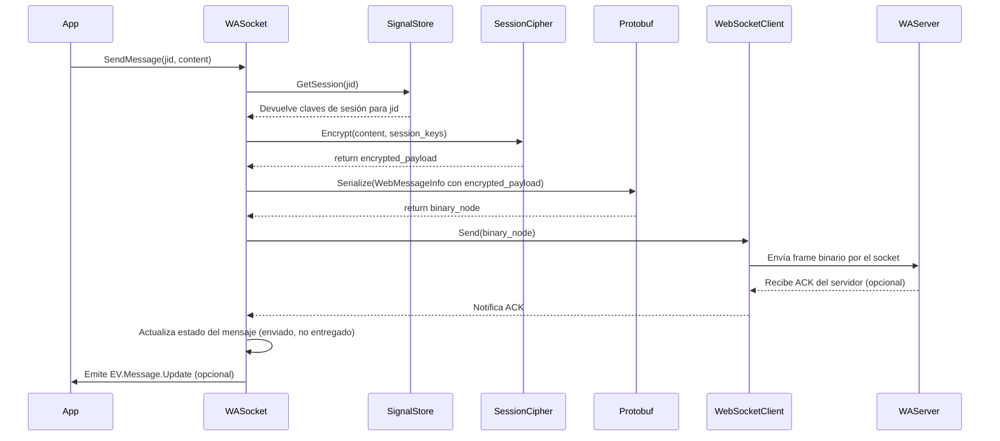
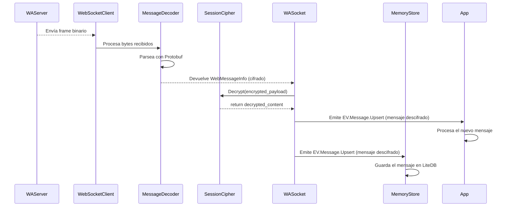
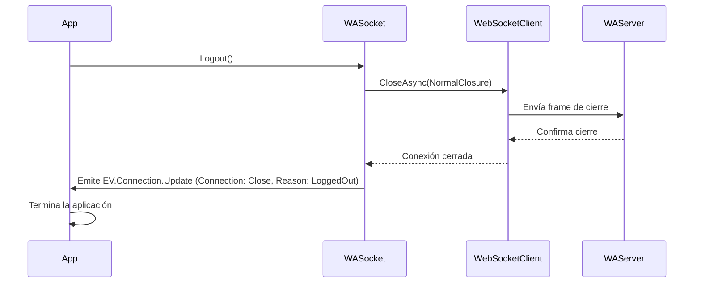

# 4. Análisis de Flujos Técnicos

Esta sección desglosa los flujos de operaciones más importantes de la librería mediante diagramas de secuencia. Esto ayuda a visualizar la interacción entre los componentes clave para realizar una tarea específica.

## 4.1. Flujo 1: Conectar y Autenticar (Nuevo Login con QR)

Este es el flujo más complejo, ya que implica la generación de credenciales, la visualización de un código QR y el handshake criptográfico.

**Actores**:
-   `App`: La aplicación cliente que consume la librería.
-   `WASocket`: La fachada principal de la librería.
-   `WebSocketClient`: El gestor de la conexión WebSocket.
-   `NoiseHandler`: Orquesta el handshake criptográfico (protocolo Noise).
-   `AuthStore`: Gestiona el almacenamiento de credenciales (`FileKeyStore`).
-   `WAServer`: El servidor WebSocket de WhatsApp.

**Diagrama de Secuencia (Mermaid)**:

**Entradas**:
-   `SocketConfig` con la configuración inicial.
-   Ausencia de un archivo `creds.json` válido.

**Salidas**:
-   Una conexión WebSocket abierta y autenticada.
-   Un archivo `creds.json` creado con las nuevas credenciales.
-   Eventos de `Connection.Update` que notifican el estado (`QR`, `Open`).

**Errores Típicos**:
-   `Timeout` durante la conexión WebSocket.
-   Error en el handshake criptográfico.
-   El usuario tarda demasiado en escanear el QR.
-   El formato de las credenciales recibidas es inválido.

---

## 4.2. Flujo 2: Enviar Mensaje de Texto

Este flujo describe el proceso desde que la aplicación solicita enviar un mensaje hasta que se cifra y se envía por el socket.

**Actores**:
-   `App`: La aplicación cliente.
-   `WASocket`: La fachada de la librería.
-   `SignalStore`: Abstracción sobre `FileKeyStore` para obtener las claves de sesión.
-   `SessionCipher`: Parte de `LibSignal`, responsable del cifrado.
-   `Protobuf`: Para serializar el mensaje al formato binario de WhatsApp.
-   `WebSocketClient`: El gestor de la conexión.

**Diagrama de Secuencia (Mermaid)**:

**Entradas**:
-   JID (identificador del destinatario).
-   Contenido del mensaje (`TextMessageContent`).
-   Una sesión autenticada y con claves de sesión válidas para el JID.

**Salidas**:
-   Un frame binario enviado al servidor de WhatsApp.
-   Opcionalmente, un evento que actualiza el estado del mensaje a "enviado".

**Errores Típicos**:
-   No se encuentra una sesión de Signal para el destinatario (error de `omemo`).
-   Fallo en el cifrado.
-   La conexión WebSocket no está abierta.

---

## 4.3. Flujo 3: Recibir Mensaje/Eventos

Este flujo detalla cómo un mensaje entrante es procesado, descifrado y notificado a la aplicación cliente.

**Actores**:
-   `WAServer`: El servidor de WhatsApp.
-   `WebSocketClient`: El gestor de la conexión.
-   `MessageDecoder`: Utilidad para parsear el frame binario.
-   `SessionCipher`: Responsable del descifrado.
-   `WASocket`: La fachada que orquesta el proceso.
-   `MemoryStore`: El listener que persiste el mensaje en LiteDB.
-   `App`: La aplicación cliente final.

**Diagrama de Secuencia (Mermaid)**:

**Entradas**:
-   Un frame binario recibido del servidor de WhatsApp.
-   Una sesión de Signal válida para descifrar el mensaje.

**Salidas**:
-   Un evento `Message.Upsert` con el mensaje descifrado.
-   El nuevo mensaje persistido en la base de datos `store.db`.

**Errores Típicos**:
-   Error de parseo de Protobuf (contrato de API roto).
-   Error de descifrado (ej. `omemo`, clave de sesión desincronizada).
-   La base de datos está bloqueada o corrupta.

---

## 4.4. Flujo 4: Cerrar Conexión Limpiamente

Este flujo describe el proceso de cierre de sesión voluntario por parte del cliente.

**Actores**:
-   `App`: La aplicación cliente.
-   `WASocket`: La fachada de la librería.
-   `WebSocketClient`: El gestor de la conexión.
-   `WAServer`: El servidor de WhatsApp.

**Diagrama de Secuencia (Mermaid)**:

**Entradas**:
-   Una conexión activa.
-   Una llamada explícita a un método de cierre de sesión (ej. `Logout()`).

**Salidas**:
-   La conexión WebSocket terminada.
-   Un evento `Connection.Update` indicando el cierre voluntario.

**Errores Típicos**:
-   La conexión ya estaba cerrada, la llamada no tiene efecto.
-   Fallo al enviar el frame de cierre (la conexión se interrumpe bruscamente en lugar de cerrarse limpiamente).
