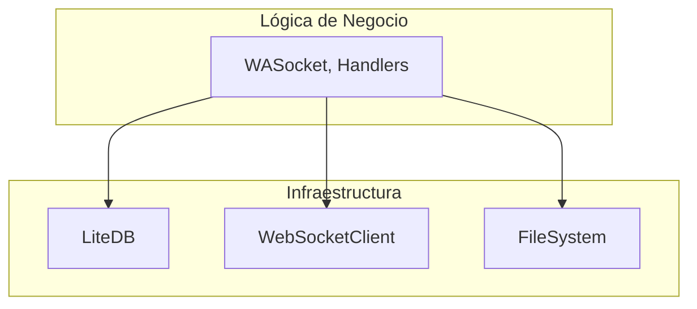
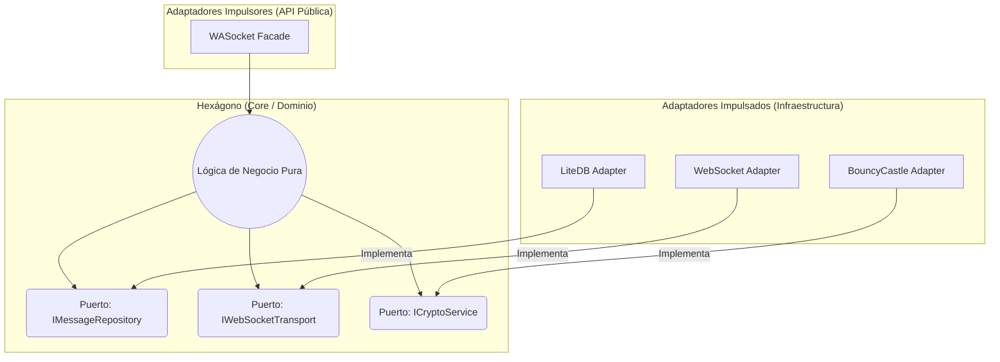

# 6b. Propuestas de Mejora: Refactor de Arquitectura

El análisis de la arquitectura actual reveló problemas significativos de acoplamiento, separación de conceptos y testabilidad. La clase `WASocket` actúa como un "God Object", centralizando demasiadas responsabilidades.

Para resolver estos problemas estructurales, se propone un rediseño basado en el patrón de **Arquitectura Hexagonal (también conocido como Puertos y Adaptadores)**.

## 6b.1. El Problema: Dependencias hacia Afuera

En la arquitectura actual, la lógica de negocio (el "Core") depende directamente de implementaciones concretas de bajo nivel (LiteDB, WebSockets, sistema de archivos). Esto crea una estructura rígida y difícil de probar.



## 6b.2. La Solución: Arquitectura Hexagonal

El principio clave de la Arquitectura Hexagonal es **invertir la dirección de las dependencias**. La lógica de negocio no debe depender de la infraestructura; la infraestructura debe depender de la lógica de negocio.

Esto se logra definiendo "Puertos" (interfaces) en el núcleo de la aplicación y "Adaptadores" (implementaciones) en la capa de infraestructura.

### Componentes de la Nueva Arquitectura

1.  **El Hexágono (Dominio/Core)**:
    -   Contendrá la lógica de negocio pura de WhatsApp (gestión de sesiones, procesamiento de eventos, etc.).
    -   **No tendrá ninguna dependencia externa** (ni a bases de datos, ni a sockets, ni a librerías de cripto).
    -   Definirá los **Puertos**: interfaces que describen los contratos necesarios.
        -   `IMessageRepository`: `Save(Message msg)`, `GetById(string id)`
        -   `IAuthCredentialStore`: `Save(Creds creds)`, `Load()`
        -   `IWebSocketTransport`: `Connect()`, `Send(byte[] data)`, `OnReceive(Action<byte[]> handler)`
        -   `ICryptoService`: `Encrypt(data, keys)`, `Decrypt(data, keys)`

2.  **Los Adaptadores**:
    -   Serán implementaciones concretas de los puertos, ubicadas en proyectos de infraestructura separados.
    -   **Adaptadores Impulsados (Driven Adapters - Lado Derecho)**: Interactúan con sistemas externos.
        -   `Persistence.LiteDBAdapter`: Implementa `IMessageRepository` usando LiteDB.
        -   `Transport.WebSocketAdapter`: Implementa `IWebSocketTransport` usando `System.Net.WebSockets`.
        -   `Security.BouncyCastleAdapter`: Implementa `ICryptoService` usando BouncyCastle.
    -   **Adaptadores Impulsores (Driving Adapters - Lado Izquierdo)**: Exponen la funcionalidad del Core al mundo exterior.
        -   `PublicApi.Facade`: La nueva clase `WASocket`, que se convierte en una fachada delgada que coordina las llamadas al Core.

### Diagrama de la Arquitectura Propuesta



## 6b.3. Inyección de Dependencias (DI)

Para que este diseño funcione, la aplicación debe ensamblarse en el arranque utilizando un contenedor de Inyección de Dependencias, como `Microsoft.Extensions.DependencyInjection`.

El código cliente se vería así:

```csharp
// En el programa principal
var services = new ServiceCollection();

// Se registran los adaptadores que se quieren usar
services.AddSingleton<IWebSocketTransport, WebSocketAdapter>();
services.AddSingleton<IMessageRepository, LiteDBAdapter>();
services.AddSingleton<ICryptoService, BouncyCastleAdapter>();
services.AddSingleton<WASocketFacade>(); // La fachada pública

var serviceProvider = services.BuildServiceProvider();
var socket = serviceProvider.GetRequiredService<WASocketFacade>();
socket.Connect();
```

## 6b.4. Beneficios del Rediseño

1.  **Testabilidad**: Se pueden probar unitariamente la lógica del Core reemplazando los adaptadores por dobles de prueba (mocks, stubs) en memoria.
2.  **Flexibilidad**: Cambiar de LiteDB a SQLite solo requeriría escribir un nuevo `SQLiteAdapter` y cambiar una línea en la configuración de DI. No habría que modificar el Core.
3.  **Separación de Conceptos (SoC)**: La lógica de negocio está completamente aislada de los detalles de la infraestructura.
4.  **Mantenibilidad**: El código es más fácil de entender, mantener y extender.
